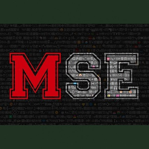

MSE PROJECT
-------------------------------------

ENCRYPTION BY MUTILPLE SUBTITUTION
---------------------------------------

REQUIS
-------------------------------------
[ Pour copier le code automatiquement ]

pip install pyperclip
-------------------------------------

le fichier keylib.py sont vous clés de chiffrement, gardez les à tous prix !
-------------------------------------
Elle est générer lorsque vous chiffrer votre premier message
-------------------------------------
Ne tantez pas d'ouvrir le fichier keylib.py ou initpat.txt, cela risque de faire bugger votre IDE
-------------------------------------
pour regénérer vos clé de chiffrement suprimmer le fichier keylib.py

-------------------------------------

    INPUT --> A --> B --> C --> output
--------------------------------------------------------------------------
    I) Bloc A
        Le text est légèrement modifier.
--------------------------------------------------------------------------
    II) Bloc B
        Chaque carcatère est subtitué.
--------------------------------------------------------------------------
    II) Bloc C
        Complexifie le code après la subtitution.

Astuces
---------------------------
Pratique pour chiffrer des phrases, créer des enigmes ou
hacher un mot de passe

modifier les caractères du fichier initpat.txt
Mettez ce que vous voulez sauf les caractères
que vous souhaitez remplacer.

Modifier la longueur des caractères générés.

Remplacer la liste de mots, par une liste
mot de votre langue ou inventez des mots.

modifier la liste des lettres spéciaux

Malgré que notre équipe n'ont toujours pas trouver de faille
Cette méthode de chiffrement reste vulnérable
aux attaques, ne chriffrer pas vos données personel avec cette méthode !!

pensez à mélanger le fichier initpat.txt à l'aide de la fonction mixeur dans les outils dans ce cas supprimez le dossier __pycache__ et régénérez vos clés

-----------------------------------
le monde merveilleux des secrets, des lettres,
chiffres et lettres.

