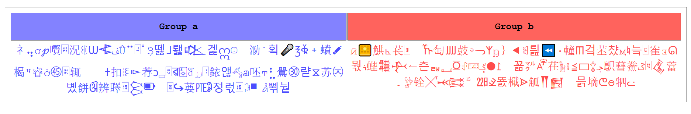
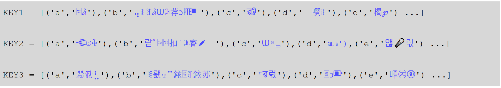

## MSE PROJECT 
## ENCRYPTION BY MUTILPLE SUBTITUTION
---------------------------------------

*Experimental encryption for text*

I choose the characters that I want to substitute:

		// Here only lowercase letters and space
		space = ' '
		charac_sub = list(ascii_lowercase+space)

I take special characters, I take whatever I want except the characters I want to substitute and put them in an inipat.txt file

I take its full length and divide it into two groups:

I generate encryption keys generate way
pseudo-random with the characters from the file initpat.txt

I substitute the characters

I add x times the characters of group b

I only substitute the words that are in the file word_lst.txt

More detail
---------------------

Initiation
-------------------------------------
> I take a character group and divide it into of them:

> group A: to generate the encryption keys
> group B: to add characters after the subtitution

I) Block A
-------------------------------------
> the messages are slightly modified by functions.

II) Block B
-------------------------------------
> Each character of the message is substituted by a group
> of randomly generated characters.

III) Block C
-------------------------------------
> I divide the character string in two then reverse the parties (see the blop64 function in MSE.py)

> characters of group b are chosen randomly and are added to the already encoded message.

REQUIRED 
-------------------------------------
> [ for copy automatically coded message ]

> pip install pyperclip

> for generate encrytion key going to keylib_generator.py, uncomment  #gen_file and run !

-------------------------------------

Be careful not to open the initpat.txt file (**it contains no code**) in an IDE (**risk of causing it to be placed**) open it in a ***notepad***.
-------------------------------------

Tips
---------------------------
> modify the characters of the initpat.txt file
> Put what you want except the characters
> that you want to substitute.

> Modify the length of the characters generated.

> This encryption method remains vulnerable
> to attacks, do not encrypt your data
> personal with this method !!

> the code is not perfect and some function
> is not explained a next update will fix all its

-----------------------------------

the wonderful world of secrets, letters,
numbers and letters ...

Example of coded messages: [Example of coded messages](https://solarissoftwarebulares.fun/)

Have fun you ;)

