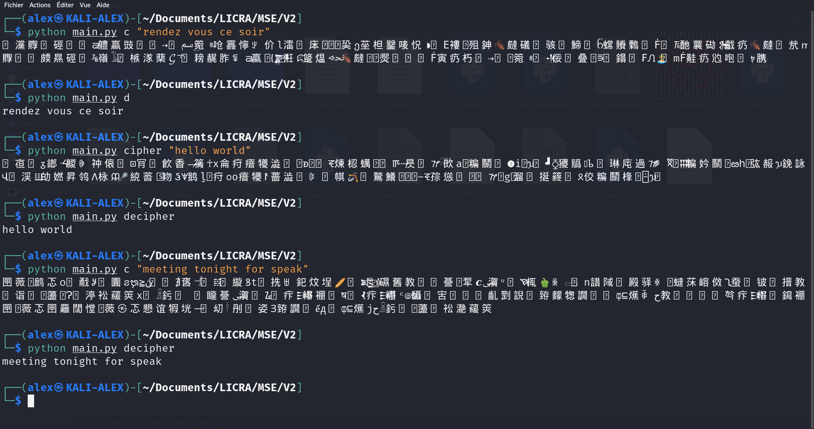
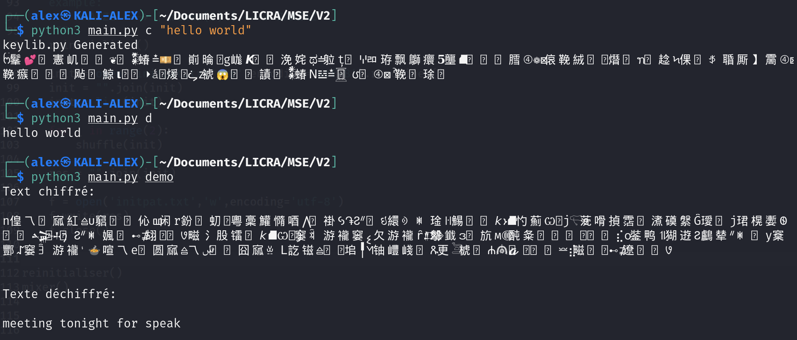

███╗   ███╗  ██████╗ ███████╗
████╗ ████║ ██╔════╝ ██╔════╝
██╔████╔██║ ╚█████╗  █████╗
██║╚██╔╝██║  ╚═══██╗ ██╔══╝
██║ ╚═╝ ██║ ██████╔╝ ███████╗
╚═╝     ╚═╝ ╚═════╝  ╚══════╝

# MSE PROJECT
-------------------------------------

# ENCRYPTION BY MUTILPLE SUBTITUTION
-------------------------------------
Chiffrement par subtitution multiple

projet sur un programme de chiffrement par subtitution multiple,
pour but de créer des messages codés avec des phrases courtes.

pratique pour:
    créer des énigmes complexes
    **aprendre la cryptographie et la cryptanalyse !**

pas pratique pour:
    **sécurisé ces données**

**Normalement il faut avoir les clés de chiffrement pour pouvoir déchiffrer les messages de quelqu'un d'autre, normalement ! (Tentez de décoder les messages sans le programme !)**

**Attention si vous perdez vos clés, tous les messages que vous avez chiffrées précédemment seront plus possible à déchiffrer (comme si vous perdez vous bitcoin à jamais !**

Tous est facilement paramétrable dans le fichier [parametre.py](https://github.com/flowlord/encryption-by-mutilple-subtitution/blob/main/parametre.py)

**Nom de version: CRC III**

---------------------------------------

# REQUIS !
-------------------------------------
Pour copier le message automatiquement vous devez installez le module [pyperclip](https://pypi.org/project/pyperclip/)

	> pip install pyperclip
	
[pyAesCrypt](https://pypi.org/project/pyAesCrypt/) pour chiffrer et envoyer vos clés de chiffrement

	> pip install pyAesCrypt

	
-------------------------------------

**le fichier keylib.py sont vous clés de chiffrement, gardez les secret à tous prix !**
Elle est générer lorsque vous chiffrer votre premier message
**Ne tantez pas d'ouvrir le fichier keylib.py ou initpat.txt, cela risque de faire bugger votre IDE**

pour régénérer vos clés de chiffrement supprimer le fichier keylib.py

-------------------------------------

    INPUT --> A --> B --> C --> output
--------------------------------------------------------------------------
    I) Bloc A
        Le texte est légèrement modifié.
--------------------------------------------------------------------------
    II) Bloc B
        Chaque caractère est substitué.
--------------------------------------------------------------------------
    II) Bloc C
        Ajoute des caractères dans le code après la substitution.

# Usage
---------------------------
	
	1) For cipher and decipher message
		-------------------------------------------->
		MSE.py c "message"
		MSE.py d (the message is automatically pasted, copy the code before paste)

	2) For cipher and decipher cipher keys
		---------------------->
		MSE.py cry
		MSE.py des PASSWORD (the password is automatically pasted, copy the password before paste)

	3) For remove cipher keys
		---------------------->
		MSE.py R
		
		
	4) For mix initpat (also removes the cipher keys)
		---------------------->
		MSE.py M
	

# Exemples:
---------------------------
	$ python MSE.py c "meeting tonight for speak"
	
	> 쓗턞🃅὎꾋⦏넲糀뀅獀㬶㜹킹껥⩞刍鲵鴇ꁺ樈蓅𒉗ﳀ𝌐㏘⠹楨ꎷ䤁ዚ㬙譆귘鷛堘籉뫴됺𒀀뀤넵⤯頨ꍪ扰𓋊Ჷ휏鹃𓃖農挘ᎇچめⶴ 㥅셋וֹ꿮뛋巭
	
	$ python MSE.py d
	
	> meeting tonight for speak

# Remarque:
Vous devez copier le message secret avant de le déchiffrer

# Astuces
---------------------------

**Attention vous devez mélanger vos caractères spéciaux (grâce à la commande: python MSE.py M), il ne doit en aucun cas ressembler à celui du code source. Prenez le code source et modifier le, créer une version personnalisée du projet, plus il ne ressemblera pas au code source originale, plus il a de chance qu'il soit difficile à casser, faite votre propre version du projet, généré votre clé de chiffrement, modifier les paramètres, envoyer le projet entier à votre correspondant et vous pouvez communiquer de manière sécurisé.**

Si le programme a du mal
à déchiffrer un mot que sa soit en français ou
en anglais vérifier l'orthographe de ce mot et/ou qui est présent dans le fichier word_lst.txt

utiliser la fonction encrypt_keylib dans tools.py pour chiffrer et envoyer vos clés de chiffrement

modifier les caractères du fichier initpat.txt
Mettez ce que vous voulez sauf les caractères
que vous souhaitez remplacer.

Modifier la longueur des caractères générés.

Remplacer la liste de mots, par une liste
mot de votre langue ou inventez des mots.

modifier la liste des lettres spéciaux

Cette méthode de chiffrement reste vulnérable
aux attaques, ne chiffrer pas vos données personel avec cette méthode !

-----------------------------------
le monde merveilleux des secrets, des lettres et des
chiffres !

-----------------------
Autre version 1: [SlotBorderCut](https://github.com/flowlord/MSE-SlotBorderCut)

Autre version 2: [GRUYERE CHEESE](https://github.com/flowlord/MSE-GRUYERE-CHEESE)

---------------------------------------
---------------------------------------

Tantez de casser l'algorithme avec le programme: [MARS ATTACK](https://discord.gg/E6qJmmKaEW)

[Serveur Discord officiel ](https://discord.gg/YQCufGwwwt)

