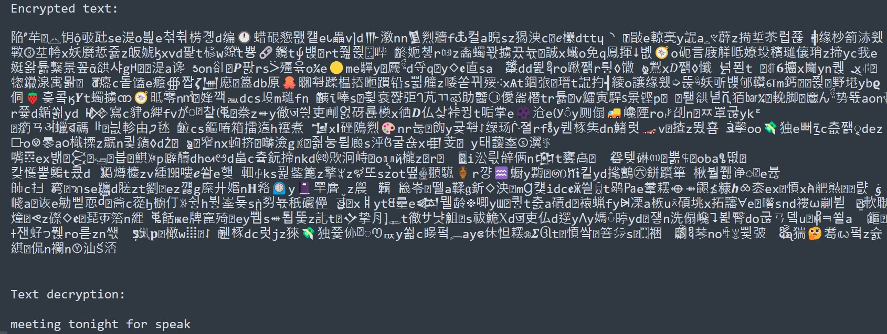

# MSE PROJECT
-------------------------------------

# ENCRYPTION BY MUTILPLE SUBTITUTION
-------------------------------------
Chiffrement par subtitution multiple

projet sur un programme de chiffrement par subtitution multiple,
pour but de créer des messages courts codés.

pratique pour:
    créer des énigmes complexes
    hacher un mot de passe
    **aprendre la cryptographie et cryptanalyse !**

pas pratique pour:
    **sécurisé ces données**

**Normalement il faut avoir les clés de chiffrement pour pouvoir déchiffrer les messages de quelqu'un d'autre, normalement ! (Tentez de décoder les messages sans le programme !)**

**Attention si vous perdez vous clés, tous les messages que vous avez chiffrées avant seront plus possible à déchiffrer (comme si vous perdez vous bitcoin à jamais !**

Tous est facilement paramétrable dans le fichier [parametre.py](https://github.com/flowlord/encryption-by-mutilple-subtitution/blob/main/parametre.py)
---------------------------------------

# REQUIS !
-------------------------------------
Pour copier le code automatiquement vous devez installez le module [pyperclip](https://pypi.org/project/pyperclip/)

> pip install pyperclip
-------------------------------------

**le fichier keylib.py sont vous clés de chiffrement, gardez les secret à tous prix !**
Elle est générer lorsque vous chiffrer votre premier message
**Ne tantez pas d'ouvrir le fichier keylib.py ou initpat.txt, cela risque de faire bugger votre IDE**

pour régénérer vos clés de chiffrement supprimer le fichier keylib.py

-------------------------------------

    INPUT --> A --> B --> C --> output
--------------------------------------------------------------------------
    I) Bloc A
        Le texte est légèrement modifié.
--------------------------------------------------------------------------
    II) Bloc B
        Chaque caractère est substitué.
--------------------------------------------------------------------------
    II) Bloc C
        Complexifie le code après la substitution.

# Attention
---------------------------
Un bug inconnu fait que parfois le programme à du mal à déchiffrer le message

# Astuces
---------------------------

modifier les caractères du fichier initpat.txt
Mettez ce que vous voulez sauf les caractères
que vous souhaitez remplacer.

Modifier la longueur des caractères générés.

Remplacer la liste de mots, par une liste
mot de votre langue ou inventez des mots.

modifier la liste des lettres spéciaux

Cette méthode de chiffrement reste vulnérable
aux attaques, ne chriffrer pas vos données personel avec cette méthode !!

pensez à mélanger les caractères du fichier initpat.txt à l'aide de la fonction mixeur.

-----------------------------------
le monde merveilleux des secrets, des lettres et des
chiffres.

[Serveur Discord Officiel ](https://discord.gg/YQCufGwwwt)

